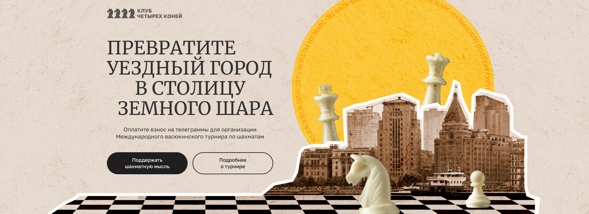

<h1 align="center"><a  href="https://develop--joyful-cannoli-389f0c.netlify.app/" target="_blank"></a></h1>

## Краткое описание:

<p align="Left"> Лендинг о любви к шахматам. Создан в рамках выполнения тестового задания для Яндекс.Крауд.</p>

[Открыть в браузере](https://develop--joyful-cannoli-389f0c.netlify.app/)

## Функционал:

- Бегущая строка
- Анимация ховера логотипа
- Слайдеры в мобильной версии страницы.

<a  href="https://develop--joyful-cannoli-389f0c.netlify.app/" target="_blank" align="center"></a>

## Технологии, использованные при создании:

- Flexbox
- Grid Layout
- CSS3 (в т.ч. анимации)
- Препроцессор (SCSS)
- Методология BEM
- Файловая структура BEM Nested
- JavaScript (ES6): работа с DOM, массивы и функции, слайдеры
- Реализация отзывчивого дизайна (desktop-first)
- Работа с Figma (pixel-perfect верстка)
- Gulp сборка

## Языки:

- HTML
- CSS
- SCSS
- JavaScript

## Локальная установка:

В командной строке перейдите в папку, где будет развернут проект. После чего скопируйте его с GitHub:

```sh
`$ git clone git@github.com:NatashaSolntseva/four-horses-chess-club.git`
```

Далее переходим в папку с проектом и устанавливаем компоненты:

```sh
`$ npm install`
```

Далее можно запускать проект на локальном сервере:

```sh
`$ gulp`
```

## Ссылки:

- [Макет в Figma](https://www.figma.com/design/0xXfupPNU3aZxPqFbmhCKb/%D0%94%D0%B8%D0%B7%D0%B0%D0%B9%D0%BD-%D0%B4%D0%BB%D1%8F-%D0%B2%D0%B5%D1%80%D1%81%D1%82%D0%BA%D0%B8-|-%D0%A2%D0%B5%D1%81%D1%82%D0%BE%D0%B2%D1%8B%D0%B9-%D0%BB%D0%B5%D0%BD%D0%B4%D0%B8%D0%BD%D0%B3?node-id=0-1&t=6RTtzpZGtxwSxCC5-0)

- [Ссылка на деплой](https://develop--joyful-cannoli-389f0c.netlify.app/)

- [По вопросам доработки сайта](https://t.me/UltraNata)
